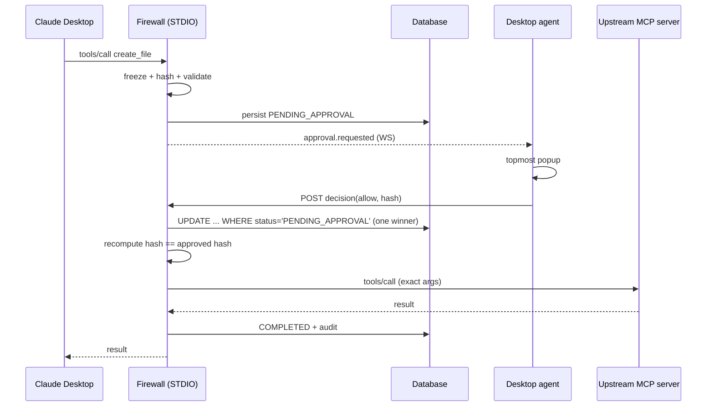
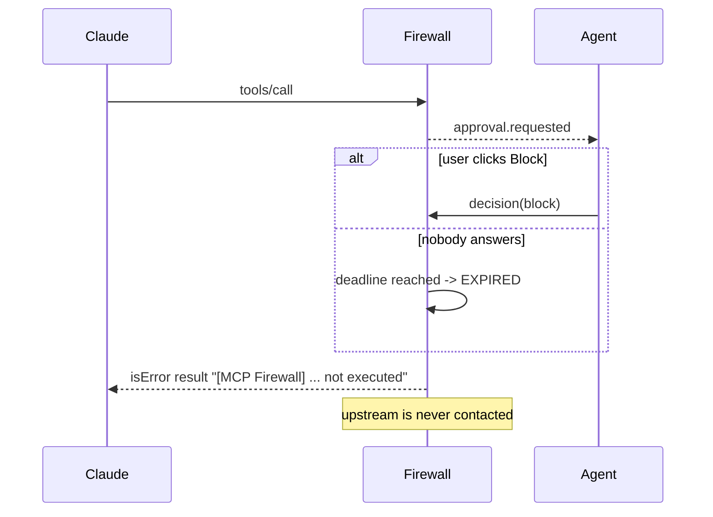
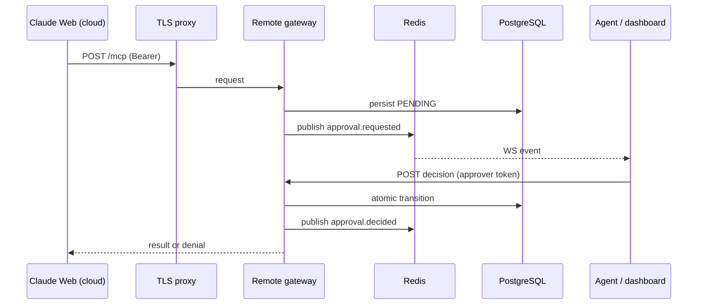

# Sequence diagrams

## Approved call (Claude Desktop)

```mermaid
sequenceDiagram
  participant C as Claude Desktop
  participant G as Firewall (STDIO)
  participant DB as Database
  participant A as Desktop agent
  participant U as Upstream MCP server
  C->>G: tools/call create_file
  G->>G: freeze + hash + validate
  G->>DB: persist PENDING_APPROVAL
  G-->>A: approval.requested (WS)
  A->>A: topmost popup
  A->>G: POST decision(allow, hash)
  G->>DB: UPDATE ... WHERE status='PENDING_APPROVAL' (one winner)
  G->>G: recompute hash == approved hash
  G->>U: tools/call (exact args)
  U-->>G: result
  G->>DB: COMPLETED + audit
  G-->>C: result
```

## Blocked / expired call

```mermaid
sequenceDiagram
  participant C as Claude
  participant G as Firewall
  participant A as Agent
  C->>G: tools/call
  G-->>A: approval.requested
  alt user clicks Block
    A->>G: decision(block)
  else nobody answers
    G->>G: deadline reached -> EXPIRED
  end
  G-->>C: isError result "[MCP Firewall] ... not executed"
  Note over G: upstream is never contacted
```

## Remote (Claude Web)

```mermaid
sequenceDiagram
  participant W as Claude Web (cloud)
  participant P as TLS proxy
  participant G as Remote gateway
  participant R as Redis
  participant D as PostgreSQL
  participant A as Agent / dashboard
  W->>P: POST /mcp (Bearer)
  P->>G: request
  G->>D: persist PENDING
  G->>R: publish approval.requested
  R-->>A: WS event
  A->>G: POST decision (approver token)
  G->>D: atomic transition
  G->>R: publish approval.decided
  G-->>W: result or denial
```
